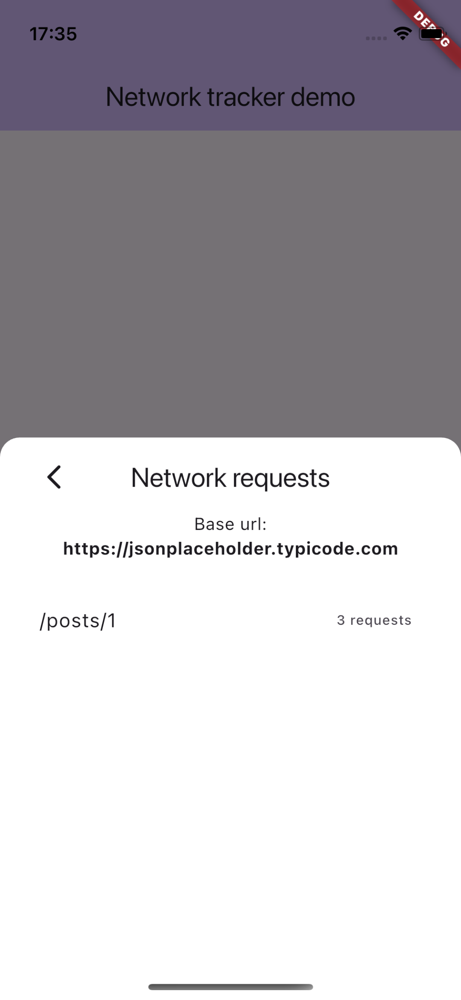
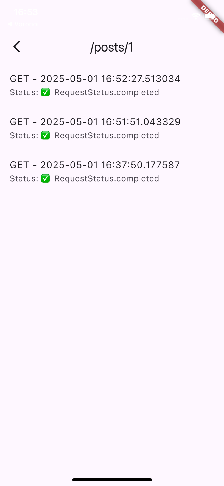
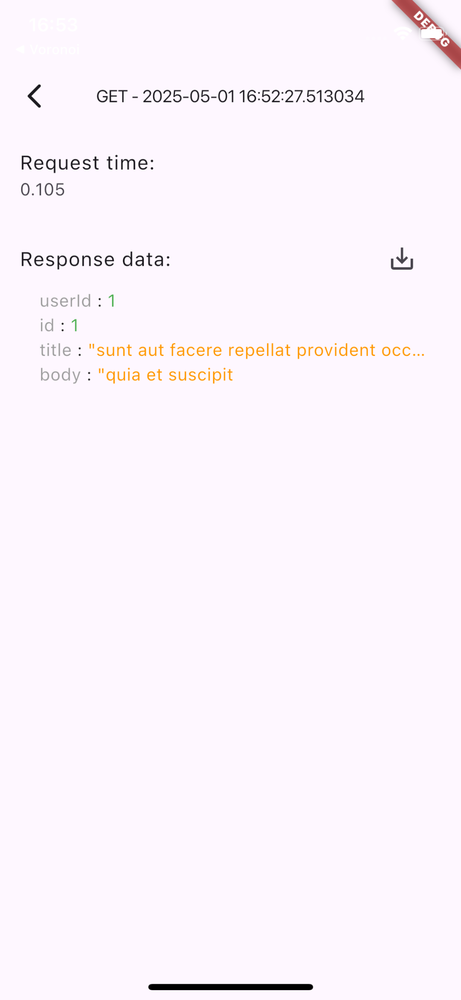
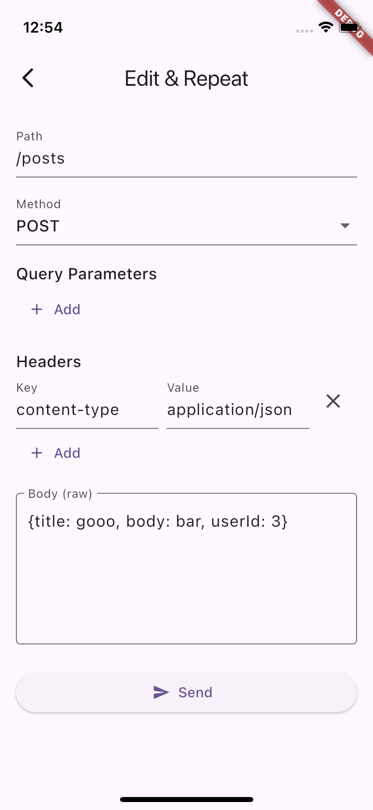

# 🛰️ Network Tracker

A lightweight and developer-friendly Flutter package for tracking and viewing all your app's HTTP network activity in real-time — powered by Dio interceptors and a clean, built-in viewer.

---

## ✨ Features

- ✅ Automatically captures all Dio HTTP requests and responses
- 🕵️‍♂️ View full request/response logs directly in your app
- ✏️ Edit and repeat any captured request — including method, path, headers, query, and body
- 💾 Persistent storage: retain request logs across app sessions
- 🌐 Multi-base URL support: track requests from multiple API clients independently
- 🔍 Search by request path and filter by method or status
- 📱 Simple integration with just two lines of code
- 📦 No need for custom tooling or complex setup
- 🚀 Built-in internet speed test tool with real-time download measurement
- 🌍 Network info panel showing external IP, geolocation, local IP
- 📋 Export requests as cURL for easy terminal debugging or sharing
- 🧩 Useful for debugging, QA, and network profiling

---

## 🚀 Getting Started
### 1. Add to your `pubspec.yaml`

```yaml
dependencies:
  network_tracker: ^0.0.1  # Replace with latest version
```

---------

## 🛠️ Usage
## 2. Just add the interceptor to your existing Dio client:

```dart
  _dio.interceptors.add(NetworkTrackerInterceptor());
```

---------

## 👁️ View requests in-app
## 3. Trigger the built-in viewer from anywhere in your app:

```dart
  NetworkRequestsViewer.showPage(context: context);
```

## Grouped summary of all tracked HTTP requests, organized by request path



## View grouped and timestamped HTTP requests by path, with detailed status tracking and drill-down into each call.




## Inspect full request details including response data, headers, status, errors, and execution time in a dedicated detail view.



## Edit any request and repeat them for quicker debug. Press repeat icon (🔁) for quick repeat or long press to open edit menu



---------

## 💾 Save or share response bodies as `.json` files

---------

## 📂 License

MIT License — free for personal or commercial use.
