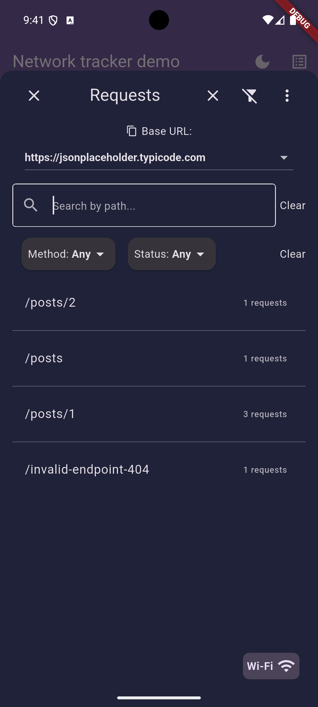
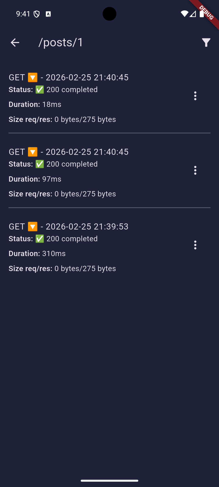
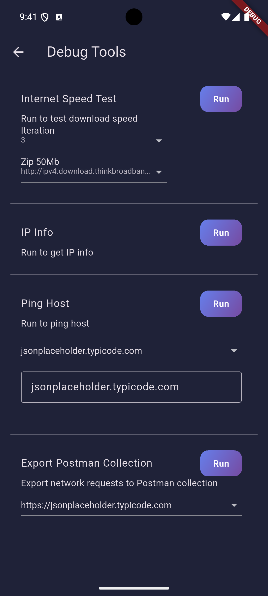
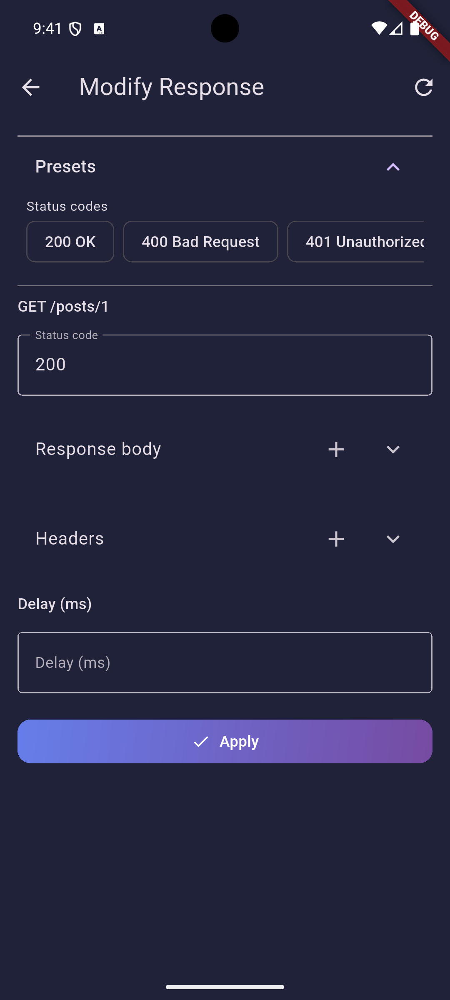

# Network Tracker

A lightweight and developer-friendly Flutter package for tracking and viewing all your app's HTTP network activity in real-time — powered by Dio interceptors and a clean, built-in viewer.

---

Useful for debugging, QA, and network profiling

---

## Features

- Automatically captures all Dio HTTP requests and responses
- View full request/response logs directly in your app
- Edit and repeat any captured request — including method, path, headers, query, and body
- Intercept and override responses for selected routes (status/body/headers/delay)
- Export tracked requests as Postman Collection JSON
- Persistent storage: retain request logs across app sessions
- Multi-base URL support: track requests from multiple API clients independently
- Search by request path and filter by method or status
- Built-in internet speed test tool
- Network info panel showing external IP, geolocation, local IP
- Host ping tool for testing network connectivity and latency
- Export requests as cURL for easy terminal debugging or sharing

---

## Getting Started
### 1. Add to your `pubspec.yaml`

```yaml
dependencies:
  network_tracker: ^0.0.1  # Replace with latest version
```

---------

## Usage
## 2. Just add the interceptor to your existing Dio client:

```dart
  _dio.interceptors.add(NetworkTrackerInterceptor());
```

---------

## View requests in-app
## 3. Trigger the built-in viewer from anywhere in your app:

```dart
  NetworkRequestsViewer.showPage(context: context);
```

### Requests Viewer

Grouped summary of tracked HTTP requests, organized by request path and base URL.



### Request Details

Drill down into each request to inspect status, method, duration, and metadata.



### Request/Response Data

Inspect full request details including response body, headers, errors, and execution time.


---------

## Debug Tools

Built-in diagnostics screen for quick network investigation without leaving the app.



### Internet Speed Test
- Test your download speed with configurable test file sizes
- Real-time speed measurement in Mbps/Gbps

### Network Information
- View external IP address with geolocation data
- Display local IP address
- Export network info as JSON file

### Host Ping
- Ping any host to test connectivity and latency
- Select from previously accessed URLs or enter custom hosts
- Continuous ping with real-time results

### Postman JSON Export
- Export captured requests as a Postman collection JSON file
- Choose a base URL and share the generated collection for API testing

## Edit & Repeat

Edit any captured request (path, method, headers, query params, body) and resend it instantly.


## Intercept Response

Create response interceptors for specific method/path routes and override status, body, headers, and delay.
You can edit interceptors from request actions or from the interceptors list in the viewer menu.
This works like a local proxy/interceptor layer inside your app: once applied, the modified response is what your app receives and renders.
Use it to quickly test endpoint behavior for different scenarios such as `400`, `401`, `404`, or `500` without changing your backend.

### Intercept setup
To use response interception in your app:
1. Register your Dio client in `NetworkRequestService`:
`NetworkRequestService.instance.setDioClient(_dio);`
2. Add `NetworkTrackerRequestModifierInterceptor()` before `NetworkTrackerInterceptor()`:

```dart
NetworkRequestService.instance.setDioClient(_dio);

_dio.interceptors.add(NetworkTrackerRequestModifierInterceptor());
_dio.interceptors.add(NetworkTrackerInterceptor());
```



---------

## Save or share response bodies as `.json` files

---------

## License

MIT License — free for personal or commercial use.
